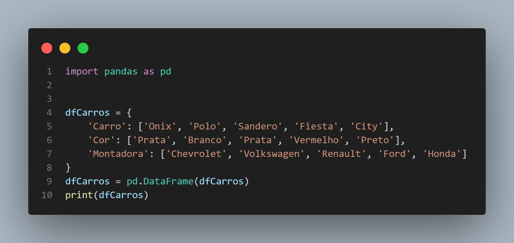
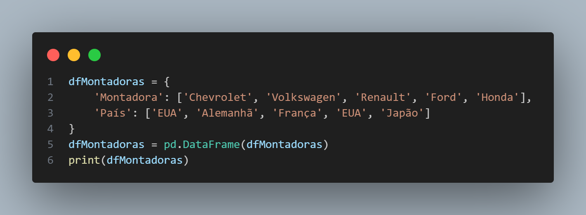
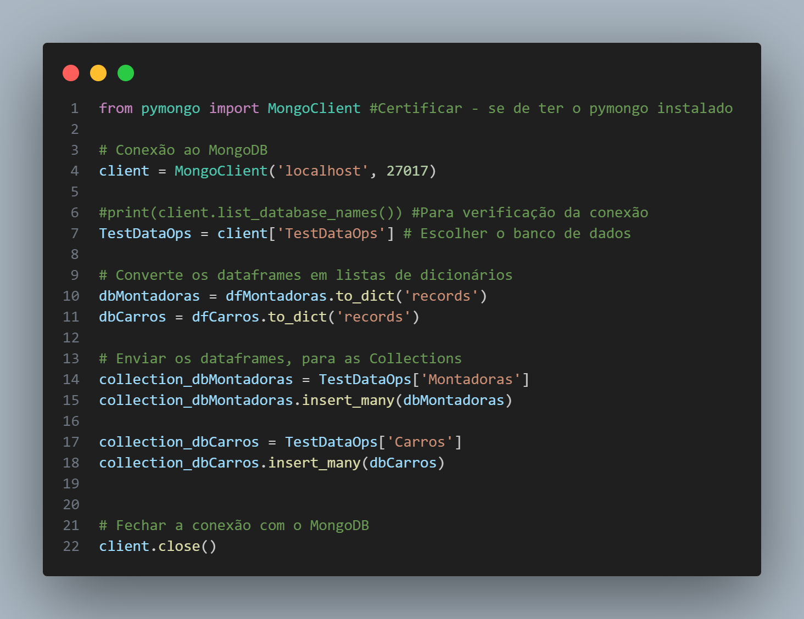
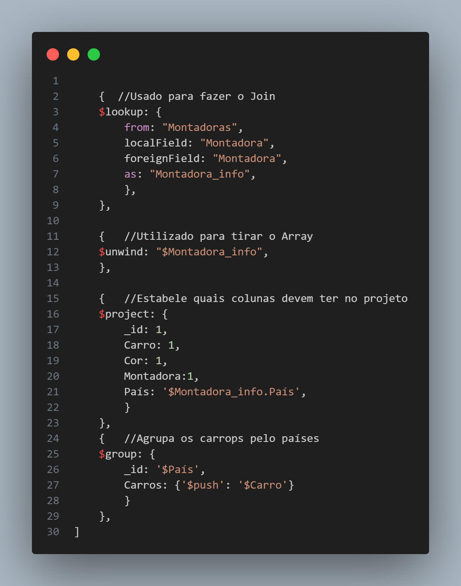
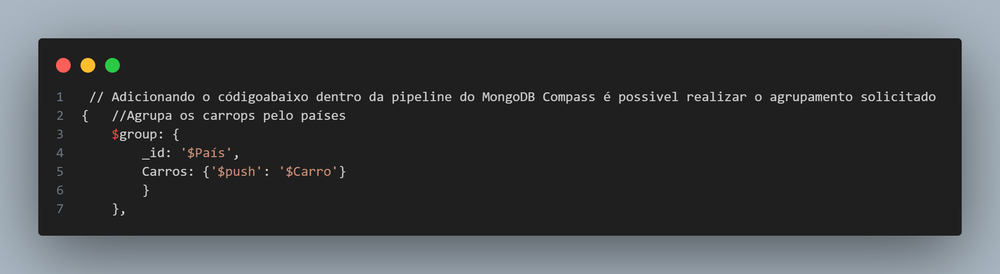

# TestDataOps
Repositório Criado para desenvolvimento do projeto de Carros e Montados, desenvolvido com Python e MongoDB Compass

1.2.	Criação do Pandas Dataframe

O início de teste se baseia em criar um arquivo em python contendo dois pandas dataframe, o primeiro onde será armazenado as informações do carro, e o segundo onde será armazenado as informações da montadora.

Para o primeiro dataframe, o resultado esperado é:

Para o segundo dataframe, o resultado esperado é:

1.3.	Salvar Pandas Dataframe no MongoDB

Após criar os pandas dataframes, definidos no passo anterior, devera salva-los nas collection correspondentes no MongoDB. 

Para isso, será necessário criar uma conexão entre o Python e o MongoDB para persistir estas informações no Banco de dados.

Sendo o primeiro dataframe salvo na collection “Carros” e o segundo dataframe salvo na collection “Montadoras”.

Com os dados salvos no MongoDB, o objetivo atual, é fazer o relacionamento entre as duas collection “Carros” e “Montadoras”, para esta relação vamos utilizar a coluna “Montadora” disponibilizadas nas duas collection.
Com o resultado deste relacionamento, precisamos extrair o campo País, de modo a obter o seguinte resultado:

1.5.	Agrupando informações

Ainda dentro da mesma agregação criada no passo anterior, será necessário, agrupar os dados pelo campo de “País”, de modo que as informações sobre o carro, fique inserida dentro de um elemento chamado “Carros”, como representado na imagem abaixo:

2.	Salvando os scripts

Ao finalizar os passos anteriores, salve todos os scripts desenvolvidos, exporte as duas collection criadas no MongoDB, e faça o upload em um repositório GIT com o nome de sua preferência, certifique-se que o repositório esteja visível para o público. Finalize também o questionário inserido no início e fim deste documento, e salve-o no GIT.

Lembre-se, o repositório deverá conter os seguintes arquivos:
•	Arquivo Python com os pandas dataframes salvando as informações no banco de dados.

        Estão Neste Notebook

•	Agregação criada no MongoDB com os passos descritos neste documento.

        Estão no arquivo CoderTestDataOps_LookupAndGroup_ Atv1.4_1.5.JS

•	Collections do MongoDB exportadas.

        Ok DataBase_TestDataOps.Montadoras e DataBase_TestDataOps.Carros, ambos em Json

•	Arquivo World contendo os questionários respondidos.

        Está neste notebook

4.	Desempenho

Descreva abaixo quais foram os pontos mais fáceis, e mais difíceis encontrados nesta atividade, caso não tenho conseguido executar algum passo nesta atividade, especifique quais as dificuldades enfrentadas que o impediu de realiza-las:

O ponto mais facíl do teste foi criação dos DataFrames. Tive um pouco de dificuldade em como fazer a conversão do Array, após o Lookup, para o formato correto. Tive que ler muita a documentação e com a ajuda de vídeos consegui compreender e entender que o Unwind, faz essa conversão.
3.	Finalização

Assim que finalizar, informe a pessoa responsável pelo processo seletivo, que as atividades desenvolvidas foram concluídas, e envie também, o link do repositório GIT onde as informações foram salvas.

Link do Repositório GIT: https://github.com/JeanBonatto/TestDataOps
